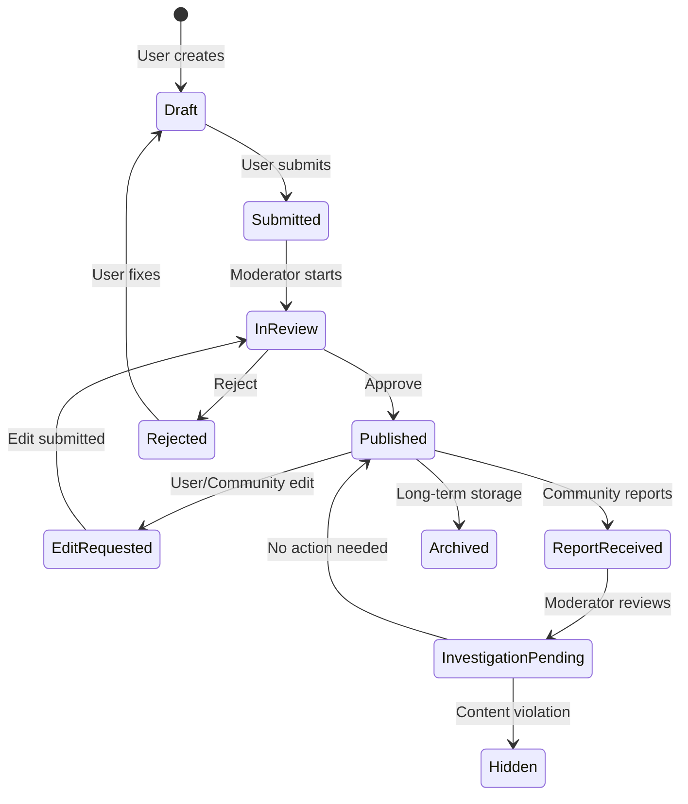

# 🏗️ THIẾT KẾ WORKFLOW TOÀN DIỆN - VIETEXPLORE AI

> **Document Version:** 1.0  
> **Date:** 2025-08-31  
> **Author:** Claude Code  
> **Review Status:** Pending Approval

## 📋 EXECUTIVE SUMMARY

Tài liệu này thiết kế một hệ thống workflow hoàn chỉnh cho VietExplore AI, bao gồm:
- ✅ **Content Lifecycle Management** - Quản lý vòng đời nội dung  
- ✅ **Community Interaction System** - Tương tác cộng đồng
- ✅ **Professional Moderation Workflow** - Quy trình kiểm duyệt chuyên nghiệp
- ✅ **Scalable Architecture** - Kiến trúc mở rộng được

## 🎯 BUSINESS OBJECTIVES

### Primary Goals:
1. **Content Quality Assurance** - Đảm bảo chất lượng nội dung
2. **Community Engagement** - Tăng tương tác cộng đồng  
3. **Operational Efficiency** - Tối ưu hóa quy trình vận hành
4. **User Experience** - Cải thiện trải nghiệm người dùng
5. **Scalability** - Khả năng mở rộng theo thời gian

### Success Metrics:
- Content approval time < 24h
- Community engagement rate > 15%
- User satisfaction score > 4.5/5
- Moderation efficiency > 90%

## 🔄 WORKFLOW OVERVIEW DIAGRAM

```
┌─────────────────┐    ┌─────────────────┐    ┌─────────────────┐
│   CONTENT       │    │   COMMUNITY     │    │   MODERATION    │
│   LIFECYCLE     │    │   INTERACTION   │    │   SYSTEM        │
└─────────────────┘    └─────────────────┘    └─────────────────┘
         │                       │                       │
         ▼                       ▼                       ▼
┌─────────────────┐    ┌─────────────────┐    ┌─────────────────┐
│ Create → Draft  │    │ View → Suggest  │    │ Queue → Review  │
│ Submit → Review │    │ View → Report   │    │ Action → Log    │
│ Publish → Live  │    │ Feedback Loop   │    │ Analytics       │
│ Edit → Re-review│    │ Notifications   │    │ Audit Trail     │
└─────────────────┘    └─────────────────┘    └─────────────────┘
```

## 📊 1. CONTENT LIFECYCLE WORKFLOW

### 1.1 Content States & Transitions



### 1.2 Detailed State Management

#### **DRAFT State**
- **Visibility:** Author only
- **Actions:** Edit, Delete, Submit
- **Duration:** Unlimited
- **Auto-save:** Every 30 seconds

#### **SUBMITTED State**  
- **Visibility:** Author + Moderators
- **Actions:** Cancel (back to Draft), Moderator actions
- **SLA:** Enter review within 12 hours
- **Queue:** Priority based on user role

#### **IN_REVIEW State**
- **Visibility:** Author + Assigned Moderator + Admin
- **Actions:** Approve, Reject, Escalate, Request changes
- **SLA:** Review within 24 hours
- **Notifications:** Author notified of status changes

#### **PUBLISHED State**
- **Visibility:** Public
- **Actions:** Edit request, Report, Suggest improvements  
- **Monitoring:** Analytics, engagement tracking
- **Protection:** Cannot be directly modified

#### **EDIT_REQUESTED State** ⭐ NEW DESIGN
- **Original content:** Remains PUBLISHED and VISIBLE
- **Edit draft:** Stored separately in moderation queue
- **User experience:** Sees original content with "Edit pending" notice
- **Moderator view:** Side-by-side comparison
- **Resolution:** Merge changes OR reject edit

## 🗃️ 2. DATABASE ARCHITECTURE REDESIGN

### 2.1 Enhanced Schema Design

```typescript
// Core Place Document (Always stable when published)
interface Place {
  id: string;
  status: 'draft' | 'submitted' | 'published' | 'hidden' | 'archived';
  
  // Core content (never changes while published)
  content: {
    name: string;
    description: string;
    shortDescription: string;
    images: Image[];
    location: LocationData;
    // ... other content fields
  };
  
  // Metadata
  meta: {
    createdBy: string;
    createdAt: string;
    publishedAt?: string;
    lastModifiedAt: string;
    version: number; // Increments on each approved edit
  };
  
  // Community interaction stats  
  community: {
    views: number;
    suggestions: number;
    reports: number;
    averageRating: number;
    lastInteractionAt?: string;
  };
  
  // Edit state tracking
  editState?: {
    hasPendingEdit: boolean;
    pendingEditId: string;
    editSubmittedAt: string;
    editSubmittedBy: string;
    editType: 'content' | 'location' | 'images' | 'comprehensive';
  };
  
  // Moderation history
  moderationHistory: ModerationEvent[];
}

// Separate Edit Requests (Never affects published content)
interface EditRequest {
  id: string;
  originalPlaceId: string;
  requestType: 'edit' | 'delete';
  
  // Snapshot of original for comparison
  originalSnapshot: Place;
  
  // Proposed changes
  proposedChanges: Partial<Place>;
  
  // Request metadata
  requestedBy: string;
  requestedAt: string;
  reason: string;
  category: 'correction' | 'improvement' | 'update' | 'removal';
  
  // Review data
  status: 'pending' | 'in_review' | 'approved' | 'rejected';
  reviewedBy?: string;
  reviewedAt?: string;
  reviewNotes?: string;
  
  // Community context
  triggeredBySuggestions?: string[]; // Suggestion IDs that led to this edit
  communitySupport?: number; // If voting system enabled
}

// Community Suggestions
interface Suggestion {
  id: string;
  placeId: string;
  
  // Suggestion content
  type: 'content_correction' | 'additional_info' | 'image_suggestion' | 'location_update';
  title: string;
  description: string;
  suggestedChanges?: any;
  
  // User data
  suggestedBy: string;
  suggestedAt: string;
  
  // Author interaction
  status: 'pending' | 'accepted' | 'declined' | 'implemented';
  authorResponse?: string;
  authorResponseAt?: string;
  
  // Moderation (if escalated)
  escalatedToModeration?: boolean;
  moderationNotes?: string;
  
  // Voting/Community feedback
  upvotes: number;
  downvotes: number;
  communityScore: number;
}

// Community Reports
interface Report {
  id: string;
  placeId: string;
  
  // Report details
  category: 'inappropriate_content' | 'misinformation' | 'spam' | 'copyright' | 'safety_concern' | 'other';
  severity: 'low' | 'medium' | 'high' | 'critical';
  description: string;
  evidence?: string[]; // URLs, screenshots, etc.
  
  // Reporter data
  reportedBy: string;
  reportedAt: string;
  reporterContact?: string; // Optional for follow-up
  
  // Moderation workflow
  status: 'submitted' | 'under_investigation' | 'escalated' | 'resolved' | 'dismissed';
  assignedTo?: string;
  investigationStartedAt?: string;
  
  // Resolution
  resolution?: string;
  resolutionType?: 'no_action' | 'content_warning' | 'content_edit' | 'content_removal' | 'user_warning';
  resolvedAt?: string;
  moderatorNotes?: string;
  
  // Follow-up
  followUpRequired?: boolean;
  followUpNotes?: string;
}

// Enhanced Moderation Queue
interface ModerationQueueItem {
  id: string;
  
  // Queue categorization
  queueType: 'new_content' | 'edit_request' | 'delete_request' | 'community_report' | 'escalated_suggestion';
  priority: 1 | 2 | 3 | 4 | 5; // 5 = highest
  
  // Content reference
  contentId: string;
  contentType: 'place' | 'itinerary' | 'review';
  
  // Submission data
  submittedBy: string;
  submittedAt: string;
  
  // Review assignment
  status: 'pending' | 'assigned' | 'in_review' | 'completed' | 'escalated';
  assignedTo?: string;
  assignedAt?: string;
  
  // SLA tracking
  slaDeadline: string; // Based on priority and queue type
  isOverdue: boolean;
  
  // Review data
  reviewStartedAt?: string;
  reviewCompletedAt?: string;
  reviewNotes?: string;
  reviewDecision?: 'approve' | 'reject' | 'escalate' | 'request_changes';
  
  // Escalation
  escalationLevel?: number;
  escalationReason?: string;
  escalatedTo?: string;
  
  // Context data (varies by queue type)
  contextData: {
    // For edit requests
    originalContent?: any;
    proposedChanges?: any;
    editReason?: string;
    
    // For reports
    reportCategory?: string;
    reportSeverity?: string;
    reportEvidence?: string[];
    
    // For suggestions
    suggestionDetails?: any;
    communitySupport?: number;
  };
}
```

## 🎨 3. USER INTERFACE DESIGN

### 3.1 Public Place View Enhancements

#### Current View + New Features:
```
┌─────────────────────────────────────────────┐
│ 📍 PHONG NHA CAVE                           │
│ ⭐⭐⭐⭐⭐ (4.8) • 1,234 reviews            │
├─────────────────────────────────────────────┤
│ [📷 Images] [📍 Location] [ℹ️ Details]      │
├─────────────────────────────────────────────┤
│ Description: A stunning limestone cave...    │
│                                             │
│ ┌─ NEW COMMUNITY FEATURES ─────────────────┐│
│ │ 💡 Suggest Improvement                   ││
│ │ ⚠️ Report Issue                         ││
│ │ ⭐ Rate & Review                        ││
│ └─────────────────────────────────────────┘│
│                                             │
│ {Edit Pending Notice if applicable}         │
└─────────────────────────────────────────────┘
```

#### Suggestion Modal:
```
┌─ Suggest Improvement ────────────────────────┐
│ What would you like to suggest?              │
│ ○ Correct information                        │
│ ○ Add missing details                        │
│ ○ Update photos                             │
│ ○ Improve description                       │
│ ○ Other                                     │
│                                             │
│ Description: [Text area]                    │
│                                             │
│ [Cancel] [Submit Suggestion]                │
└─────────────────────────────────────────────┘
```

#### Report Modal:
```
┌─ Report Place ───────────────────────────────┐
│ Why are you reporting this place?            │
│ ○ Inappropriate content                      │
│ ○ Incorrect information                      │
│ ○ Spam or fake                              │
│ ○ Safety concerns                           │
│ ○ Copyright violation                       │
│ ○ Other                                     │
│                                             │
│ Details: [Text area]                        │
│ Evidence: [File upload - optional]          │
│                                             │
│ [Cancel] [Submit Report]                    │
└─────────────────────────────────────────────┘
```

### 3.2 Author Dashboard Redesign

```
┌─ My Content Dashboard ──────────────────────────────────────┐
│ 📊 Overview: 12 Published • 3 Drafts • 2 Pending Review    │
├─────────────────────────────────────────────────────────────┤
│ 🔔 Notifications (5)                                       │
│ • New suggestion for "Phong Nha Cave"                      │
│ • Edit approved for "Ha Long Bay"                          │
│ • Review completed for "Sapa Trek"                         │
├─────────────────────────────────────────────────────────────┤
│ 📝 Recent Activity                                         │
│ Phong Nha Cave    💡 3 suggestions    📊 1,234 views      │
│ Ha Long Bay       ✅ Edit approved    📊 890 views        │
│ Sapa Trek         ⏳ Review pending   📊 567 views        │
├─────────────────────────────────────────────────────────────┤
│ 💡 Pending Suggestions (3)                                 │
│ [Review Suggestions]                                       │
└─────────────────────────────────────────────────────────────┘
```

### 3.3 Admin Moderation Dashboard 

```
┌─ Moderation Dashboard ──────────────────────────────────────┐
│ 📊 Queue Overview                                          │
│ 📝 New Content (12)  ✏️ Edits (5)  🗑️ Deletions (2)      │
│ ⚠️ Reports (8)       💡 Escalated Suggestions (3)         │
├─────────────────────────────────────────────────────────────┤
│ 🚨 Urgent Items (SLA < 2 hours)                           │
│ • HIGH: Report - Safety concern at "Dangerous Cliff"       │
│ • MED: Edit request - "Ha Long Bay" information update     │
├─────────────────────────────────────────────────────────────┤
│ 📋 Queue Tabs:                                            │
│ [All] [New Content] [Edit Requests] [Reports] [Deletions] │
│                                                            │
│ Filters: [Priority] [Assigned] [SLA Status] [Date Range]  │
│                                                            │
│ ┌─ Queue Items ─────────────────────────────────────────┐ │
│ │ ✏️ Edit Request • Ha Long Bay                         │ │
│ │ 👤 John Doe (Contributor) • 2 hours ago               │ │
│ │ 🔄 Original vs Proposed • [Review] [Assign to me]     │ │
│ └───────────────────────────────────────────────────────┘ │
└─────────────────────────────────────────────────────────────┘
```

## 🔄 4. DETAILED WORKFLOW PROCESSES

### 4.1 Edit Request Workflow (FIXED LOGIC)

```
Phase 1: Request Initiation
┌─ User clicks "Edit" on published place
├─ System checks: User is author OR has edit permission
├─ Create EditRequest document
├─ Original place REMAINS published and visible
└─ Redirect to edit form with current content

Phase 2: Edit Submission  
┌─ User makes changes in edit form
├─ System validates changes
├─ Create diff comparison
├─ Add to moderation queue as "edit_request" type
├─ Set place.editState.hasPendingEdit = true
├─ Notify moderators
└─ User sees "Edit submitted for review" message

Phase 3: Moderation Review
┌─ Moderator views edit in queue
├─ Side-by-side comparison: Original vs Proposed
├─ Context: Community suggestions that triggered edit
├─ Decision options:
│  ├─ APPROVE: Apply changes to original place, increment version
│  ├─ REJECT: Keep original, add rejection reason
│  ├─ REQUEST_CHANGES: Back to author with specific feedback
│  └─ ESCALATE: Send to senior moderator/admin
└─ Resolution notifications to all parties

Phase 4: Resolution Actions
┌─ IF APPROVED:
│  ├─ Merge changes to original place
│  ├─ Increment version number
│  ├─ Clear editState flags
│  ├─ Archive EditRequest
│  ├─ Notify author of approval
│  └─ Log all changes in audit trail
│
├─ IF REJECTED:
│  ├─ Keep original place unchanged
│  ├─ Clear editState flags  
│  ├─ Archive EditRequest with rejection reason
│  ├─ Notify author with feedback
│  └─ Optional: Convert to suggestion for author
│
└─ IF REQUEST_CHANGES:
   ├─ Keep original published
   ├─ Return EditRequest to author
   ├─ Provide specific feedback
   └─ Author can resubmit or cancel
```

### 4.2 Community Suggestion Workflow

```
Phase 1: Suggestion Submission
┌─ User views published place
├─ Clicks "Suggest Improvement"  
├─ Fills suggestion form with category
├─ System creates Suggestion document
├─ Notify place author
└─ User sees "Suggestion sent to author" confirmation

Phase 2: Author Review
┌─ Author receives notification
├─ Reviews suggestion in dashboard
├─ Decision options:
│  ├─ ACCEPT: Implement suggestion immediately OR create edit request
│  ├─ DECLINE: Provide polite reason
│  └─ ESCALATE: Send to moderation if inappropriate
└─ Response notification to suggester

Phase 3: Implementation (if accepted)
┌─ IF Direct implementation possible (minor changes):
│  ├─ Author makes change directly
│  └─ Suggestion marked as "implemented"
│
└─ IF Major changes needed:
   ├─ Author creates EditRequest based on suggestion
   ├─ EditRequest includes suggestion context
   └─ Normal edit workflow proceeds
```

### 4.3 Community Report Workflow

```
Phase 1: Report Submission
┌─ User clicks "Report Issue"
├─ Selects category and severity
├─ Provides description and evidence
├─ System creates Report document
├─ Auto-assigns based on severity:
│  ├─ LOW: Standard queue
│  ├─ MEDIUM: Priority queue  
│  ├─ HIGH: Urgent queue
│  └─ CRITICAL: Immediate escalation
└─ Reporter receives confirmation

Phase 2: Triage and Investigation
┌─ Moderator reviews report
├─ Validates evidence and claims
├─ Investigation actions:
│  ├─ Contact content author for response
│  ├─ Gather additional evidence
│  ├─ Consult community guidelines
│  └─ Determine severity level
└─ Update report status

Phase 3: Resolution
┌─ Based on investigation findings:
│  ├─ NO ACTION: Report dismissed with explanation
│  ├─ CONTENT WARNING: Add warning label to place
│  ├─ CONTENT EDIT: Request/force content changes  
│  ├─ CONTENT REMOVAL: Hide place from public
│  └─ USER ACTION: Warning/suspension for author
├─ Document resolution thoroughly
├─ Notify all parties involved
└─ Close report with audit trail
```

## 📈 5. IMPLEMENTATION ROADMAP

### Phase 1: Critical Fixes (Week 1-2) 🚨
- [ ] Fix edit request logic (places stay visible)
- [ ] Update moderation queue UI for edit requests
- [ ] Implement proper status management
- [ ] Add edit state tracking to Place schema

### Phase 2: Community Features (Week 3-5) 🎯
- [ ] Implement suggestion system
- [ ] Implement report system  
- [ ] Create author notification system
- [ ] Build community interaction UI

### Phase 3: Enhanced Moderation (Week 6-8) 📊
- [ ] Separate moderation queue types
- [ ] Advanced filtering and search
- [ ] SLA tracking and alerts
- [ ] Analytics dashboard

### Phase 4: Advanced Features (Future) 🚀
- [ ] Automated moderation rules
- [ ] Community voting on suggestions
- [ ] Reputation system
- [ ] AI-powered content analysis

## 🎯 SUCCESS CRITERIA

### Technical Metrics:
- [ ] Edit requests maintain 100% uptime for published content
- [ ] Average response time < 200ms for all community interactions
- [ ] 99.9% data consistency across edit workflows
- [ ] Zero data loss during edit operations

### User Experience Metrics:
- [ ] Community suggestion adoption rate > 40%
- [ ] Report resolution time < 48 hours average
- [ ] User satisfaction score > 4.5/5 for moderation experience
- [ ] Edit request completion rate > 85%

### Business Metrics:
- [ ] 50% increase in community engagement
- [ ] 30% reduction in moderation workload through automation
- [ ] 25% improvement in content quality scores
- [ ] 95% compliance with content guidelines

---

## 📝 APPROVAL CHECKLIST

- [ ] **Business Requirements Approved** - Stakeholder sign-off
- [ ] **Technical Architecture Approved** - Engineering team review
- [ ] **UI/UX Design Approved** - Design team approval
- [ ] **Security Review Completed** - Security team assessment  
- [ ] **Performance Impact Assessed** - Infrastructure team review
- [ ] **Implementation Timeline Agreed** - Project management approval

---

**📋 STATUS: PENDING REVIEW & APPROVAL**  
**📅 Target Approval Date:** TBD  
**🚀 Implementation Start:** Upon approval